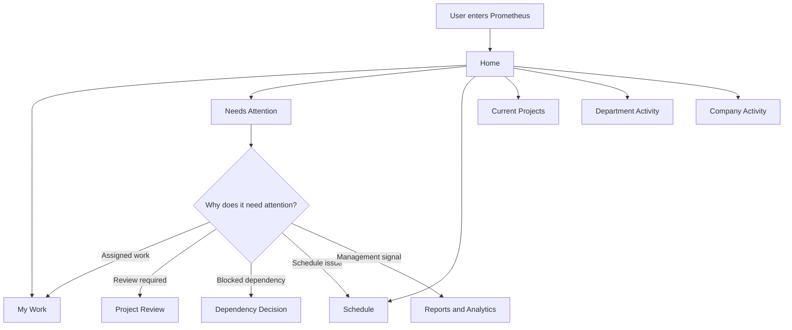
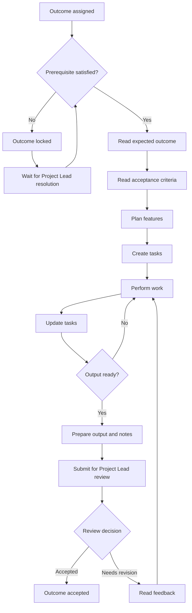
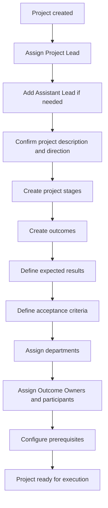
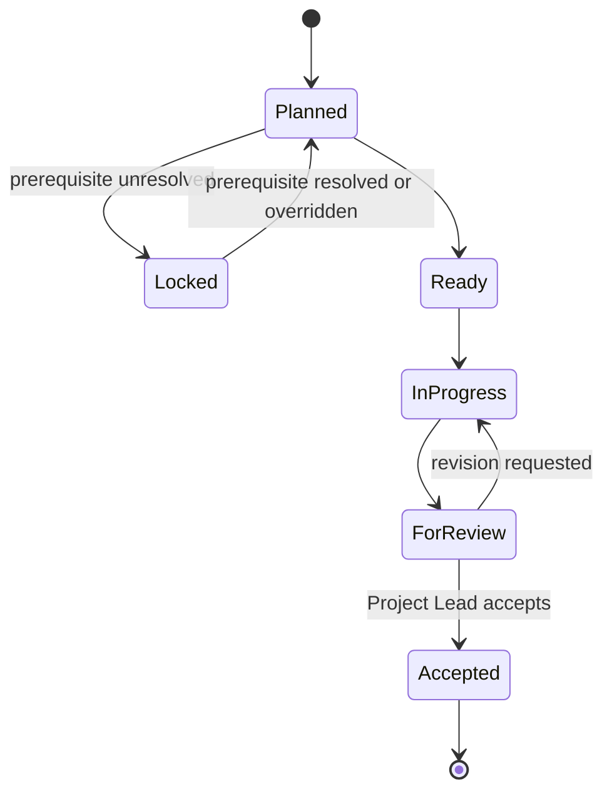
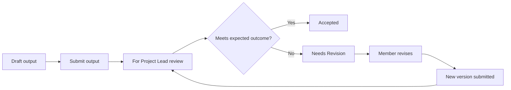
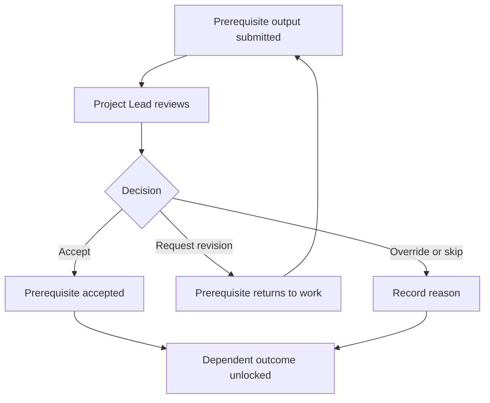
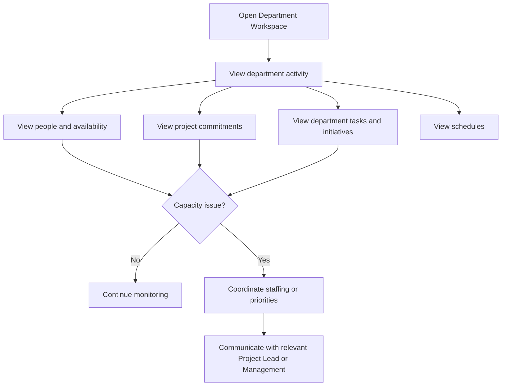
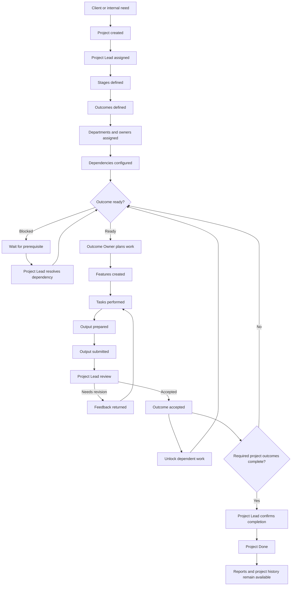

# Prometheus System Flow

**Status:** Draft  
**Purpose:** Define how people, projects, outcomes, work, reviews, and management visibility flow through Prometheus.

## 1. System Objective

Prometheus is the company's virtual office.

Its purpose is not only to store tasks.

It should make company operations understandable from the perspective of each employee.

Every user should be able to answer two questions after entering the system:

1. What is happening around me?
2. What do I need to do next?

The system should provide enough context for a person to act without forcing them to reconstruct information from several chats, documents, meetings, and task lists.

At the same time, users should not be overwhelmed by information unrelated to their role, department, or projects.

---

## 2. Core Operating Model

Prometheus organizes work using the following hierarchy:

```text
Company
├── Departments
│   ├── R&D
│   ├── Creatives
│   └── Sales & Marketing
│
└── Projects
    ├── Project Lead
    ├── Assistant Lead, if assigned
    ├── Project Members
    │
    └── Stages
        └── Outcomes
            ├── Assigned Department
            ├── Outcome Owner
            ├── Participants
            ├── Acceptance Criteria
            ├── Prerequisites
            ├── Features
            │   └── Tasks
            └── Outputs
                └── Project Lead Review
```

The **Outcome** is the main unit of project accountability.

An outcome describes the result that must exist.

Features and tasks describe how the assigned people intend to produce that result.

An output is the evidence or deliverable submitted to prove that the outcome has been achieved.

The Project Lead reviews the output against the expected outcome and its acceptance criteria.

---

## 3. Roles Are Responsibilities, Not Fixed Job Titles

Prometheus should treat roles as responsibilities and permissions.

A person may hold more than one role.

For example, in a small startup, the same employee may simultaneously be:

- part of Management,
- the Project Lead of one project,
- a Project Member of another project,
- and the Outcome Owner of technical work inside a project.

The interface should therefore adapt to what the current user is responsible for instead of assuming that every role belongs to a different employee.

---

## 4. Main Roles

### 4.1 Company Member

A Company Member is any employee using Prometheus.

A Company Member should be able to see work relevant to their projects, department, schedule, and responsibilities.

Their main question is:

> What should I work on now?

A Company Member may also become a Project Member, Outcome Owner, Project Lead, Department Manager, or Management user depending on their responsibilities.

---

### 4.2 Project Member

A Project Member belongs to the temporary working group formed around a project.

Project Members may come from different departments.

A Project Member can participate in one or more outcomes.

Their responsibility is to contribute the work necessary to achieve assigned outcomes.

---

### 4.3 Outcome Owner

The Outcome Owner is the primary person responsible for producing a specific result.

The Outcome Owner does not need the Project Lead to define every implementation task.

The Project Lead defines the expected result.

The Outcome Owner determines how to produce it.

The Outcome Owner may:

- organize the outcome into features,
- create and manage tasks,
- collaborate with other participants,
- update work progress,
- prepare the required output,
- submit output for review,
- respond to revision feedback,
- and submit new output versions.

---

### 4.4 Outcome Participant

An Outcome Participant assists the Outcome Owner.

Participants may contribute to features and tasks when they belong to the outcome.

Participation allows cross-functional collaboration without changing who is primarily accountable for the outcome.

---

### 4.5 Project Lead

The Project Lead is responsible for project direction and outcome-level accountability.

The Project Lead should focus on **what must be achieved**, not on manually planning every task performed by every member.

The Project Lead may:

- define project stages,
- define project outcomes,
- define expected results,
- define acceptance criteria,
- assign departments,
- assign Outcome Owners,
- add project participants,
- establish dependencies between outcomes,
- inspect member work plans,
- review submitted outputs,
- accept outputs,
- request revisions,
- resolve or override dependencies,
- monitor project progress,
- communicate project decisions,
- and update the overall project state.

The Project Lead is the main authority for deciding whether an outcome has actually been satisfied.

---

### 4.6 Assistant Lead

The Assistant Lead supports the Project Lead in coordination and project operations.

The current model establishes the Assistant Lead as a project role but does not yet fully define its authority.

For the current system flow, the Assistant Lead should primarily support:

- coordination,
- follow-ups,
- project communication,
- schedule awareness,
- activity monitoring,
- and surfacing issues to the Project Lead.

Final outcome acceptance should remain with the Project Lead unless Prometheus later introduces explicit delegated review authority.

---

### 4.7 Department Manager or Department Lead

A Department Manager oversees the continuing operations of a department.

The department view is different from the project view.

Projects are temporary and cross-functional.

Departments are persistent organizational homes.

A Department Manager should be able to understand:

- what the department is currently working on,
- which projects require department members,
- who is active or occupied,
- what department-level work is underway,
- what schedules are approaching,
- where work is blocked,
- and where capacity or coordination problems exist.

The Department Manager should not need to enter every project and inspect every task individually to understand department health.

---

### 4.8 Management or Leadership

Management needs company-level operating visibility.

Management should primarily consume summarized information and drill into exceptions when necessary.

Their view should answer questions such as:

- Which projects are healthy?
- Which projects are delayed or blocked?
- Which outcomes are waiting for review?
- Where is team capacity concentrated?
- Which departments are overloaded or underused?
- What deadlines are approaching?
- What important activity changed recently?
- What requires management attention?

Management should not need to micromanage individual member tasks to understand company performance.

---

### 4.9 Sales and Marketing or Account Manager

Sales and Marketing may participate before, during, and after project creation.

Their work may include:

- lead generation,
- client inquiries,
- requirements discovery,
- proposal preparation,
- client onboarding,
- client communication,
- account management,
- collecting feedback,
- communicating approvals,
- and coordinating client-facing decisions.

Once an engagement becomes a project, Sales and Marketing may become part of the project working group.

Client-related responsibilities should be represented as project outcomes when they produce a concrete result.

Examples include:

- validated client requirements,
- client approval,
- communication plans,
- launch materials,
- and release confirmation.

---

### 4.10 QA, Tester, Designer, Developer, and Other Specialists

Specialist titles describe the person's expertise.

They do not require separate project-management structures.

A developer, designer, tester, marketer, researcher, or other specialist becomes part of the project through outcomes and participation.

Their workflow follows the same outcome model:

```text
Expected Outcome
→ Work Plan
→ Features
→ Tasks
→ Output
→ Review
```

---

## 5. System Entry Flow

When a user opens Prometheus, the system should prioritize information based on their responsibilities.



The Home view should function as the user's operating dashboard.

It should not require users to remember which project or department they need to open first.

---

## 6. Company Member Workflow

A regular member's daily flow should be simple.

```text
Open Prometheus
→ Check My Work
→ Check Needs Attention
→ Review schedule
→ Open assigned outcome
→ Continue work
→ Update tasks
→ Prepare output
→ Submit output
→ Respond to feedback if needed
```

### Member Flow

1. The member enters Prometheus.
2. The member sees assigned outcomes and relevant tasks.
3. The member checks whether any assigned outcome is locked, ready, in progress, or awaiting revision.
4. The member opens the highest-priority outcome.
5. The member reads the expected outcome and acceptance criteria.
6. The member organizes the work into features and tasks.
7. The member completes tasks as work progresses.
8. Prometheus updates work progress from the defined tasks.
9. The member prepares an output when the result is ready.
10. The member submits the output with notes explaining what changed and what should be verified.
11. The Project Lead reviews the submission.
12. If accepted, the outcome is completed.
13. If revision is requested, the member receives the feedback and continues work.
14. The member submits a new version when the revision is ready.

---

## 7. Outcome Owner Workflow

The Outcome Owner is responsible for converting an expected result into an actual deliverable.



The work plan belongs primarily to the people performing the work.

This prevents the Project Lead from becoming a bottleneck for implementation planning.

---

## 8. Project Lead Workflow

The Project Lead workflow is centered on direction, coordination, dependencies, and verification.

### 8.1 Starting a Project



A newly created project should not require pre-generated stages.

The Project Lead should intentionally create the structure appropriate to that project.

### 8.2 During Project Execution

The Project Lead should routinely:

1. Open the project workspace.
2. Check outcomes that need review.
3. Check blocked outcomes and prerequisites.
4. Check project-level progress.
5. Check recent project activity.
6. Inspect outputs that require verification.
7. Review expected outcomes against submitted outputs.
8. Accept valid work or request a specific revision.
9. Resolve dependencies when accepted work unlocks downstream work.
10. Adjust project outcomes when project direction changes.
11. Communicate decisions through the project workspace.
12. Update the project's summary state when appropriate.

The Project Lead should avoid manually managing every member task unless the situation specifically requires intervention.

---

## 9. Project Creation Flow

Prometheus should separate **creating a project** from **planning the work inside the project**.

### Project Creation

The initial project record should contain only the information necessary to establish ownership and context.

Recommended project setup fields are:

- Project name,
- Project description,
- Project Lead,
- Assistant Lead, optional,
- participating departments,
- and initial project state.

### Project Planning

After creation, the Project Lead enters the project workspace and defines:

```text
Project
→ Stages
→ Outcomes
→ Acceptance Criteria
→ Departments
→ Owners
→ Participants
→ Dependencies
```

Features and tasks should generally be defined later by the members responsible for the outcomes.

---

## 10. Stage Workflow

Stages organize the project into understandable groups of outcomes.

Stages are **not rigid waterfall gates**.

A project may contain stages such as:

```text
Discovery & Planning
Experience Design & Build
Core Development
Testing & Release
```

However, work may move backward or overlap when necessary.

A later stage may contain work that is ready to begin while another outcome from an earlier stage is still active.

Dependencies should therefore exist between specific outcomes rather than assuming that every outcome in Stage 1 must finish before anything in Stage 2 may begin.

---

## 11. Outcome Workflow

The recommended outcome states are:

```text
Planned
→ Ready
→ In Progress
→ For Review
→ Accepted
```

An outcome may also be:

```text
Locked
```

when a prerequisite has not yet been resolved.

A reviewed outcome may return to:

```text
In Progress
```

when the Project Lead requests revision.

A prerequisite may also be deliberately skipped or overridden by the Project Lead when project direction changes.

### Outcome State Flow



---

## 12. Feature and Task Workflow

Features and tasks are implementation planning tools.

They should not replace outcomes as the project's main accountability structure.

The member responsible for an outcome may break the work down as:

```text
Outcome
├── Feature A
│   ├── Task 1
│   ├── Task 2
│   └── Task 3
│
└── Feature B
    ├── Task 4
    └── Task 5
```

The broader software task workflow may follow:

```text
Backlog
→ Ready
→ In Progress
→ For Review
→ Testing
→ Done
```

Tasks may move backward when revisions or defects are discovered.

Task completion represents **work progress**.

Task completion does not automatically mean that the outcome has been accepted.

---

## 13. Progress Flow

Prometheus should distinguish **progress** from **acceptance**.

### Work Progress

When an outcome contains tasks, task completion can be used to calculate its work progress.

Example:

```text
8 tasks total
6 tasks complete
= 75% work progress
```

### Outcome Acceptance

An outcome becomes 100% accepted only when the submitted output has been accepted by the Project Lead.

Therefore:

```text
Tasks completed ≠ Outcome accepted
```

This prevents a project from appearing complete simply because checkboxes were marked done.

---

## 14. Output and Review Workflow

Outputs are the evidence that an outcome has actually been produced.

An output may be:

- a deployed build,
- a GitHub pull request,
- a Figma prototype,
- a document,
- a requirements package,
- a test result,
- a marketing asset,
- a client approval,
- a report,
- or another verifiable deliverable.

### Submission Flow



Every submission should retain its version, notes, review result, and feedback.

The history should make it possible to understand how the deliverable evolved.

---

## 15. Project Lead Review Flow

When an output is submitted, the Project Lead should see the review in three parts.

### 1. Expected Outcome

What result was the member asked to produce?

### 2. Acceptance Criteria

What conditions must be true before the outcome can be accepted?

### 3. Submitted Output

What did the member actually produce?

The Project Lead then chooses:

```text
Accept
or
Request Revision
```

Revision feedback should explain what still needs to change.

Acceptance should change the outcome state to Accepted and may unlock dependent outcomes.

---

## 16. Dependency Workflow

Dependencies coordinate cross-functional work without forcing the entire project into a rigid sequence.

Example:

```text
Creatives
Approved Application UI/UX
        ↓ prerequisite
R&D
Implemented Approved Interface
```

The R&D outcome may remain locked until the required Creatives outcome is accepted.

### Dependency Resolution



The Project Lead owns dependency overrides because bypassing a prerequisite changes the project plan.

The reason for an override should remain visible in project activity.

---

## 17. Assistant Lead Workflow

The Assistant Lead should help reduce coordination overhead for the Project Lead.

A practical flow is:

```text
Open project
→ Review activity and schedule
→ Identify pending follow-ups
→ Check blocked or inactive work
→ Coordinate with members
→ Surface decisions requiring Project Lead authority
→ Track whether decisions were acted upon
```

The Assistant Lead should help keep information current.

The Assistant Lead should not silently replace Project Lead acceptance authority unless delegated permissions are explicitly implemented.

---

## 18. Department Member Workflow

A department member has two overlapping contexts:

```text
Department Context
+
Project Context
```

The department context answers:

> What is my team doing?

The project context answers:

> What are we producing for this specific project?

A member should be able to move between these contexts without duplicating work.

The same project outcome may appear inside the project workspace and also contribute to the department's workload view.

---

## 19. Department Manager Workflow

The Department Manager should begin from the Department Workspace.



The Department Manager's role is operational visibility and coordination across projects.

The Department Manager should not need to become the Project Lead of every project involving their department.

---

## 20. Management Workflow

Management should start from company-level operating intelligence rather than individual task boards.

### Management Flow

```text
Open Prometheus
→ Review company overview
→ Review project health
→ Review outcome pipeline
→ Review team capacity
→ Review schedules and deadlines
→ Review company activity
→ Check Needs Attention
→ Drill into exceptions
→ Coordinate decision or intervention
```

### Management Should Focus On

- project health,
- delivery risk,
- unresolved blockers,
- overdue reviews,
- team capacity,
- department workload,
- approaching deadlines,
- major client-related issues,
- and company-wide activity.

Management should be able to drill down from:

```text
Company
→ Department or Project
→ Stage
→ Outcome
→ Output / Work Detail
```

This allows leadership to inspect details when necessary without making detailed task management the default management interface.

---

## 21. Sales and Marketing Workflow

Sales and Marketing may operate across both the company workflow and individual projects.

### Pre-Project

```text
Lead
→ Inquiry
→ Discovery
→ Client needs
→ Proposal
→ Approval
→ Project creation
```

### During Project

```text
Project membership
→ Client communication
→ Requirements clarification
→ Feedback collection
→ Client-facing outcomes
→ Client approvals
→ Handoff to internal teams
```

Sales and Marketing should capture important client decisions inside the relevant project instead of leaving critical context only inside private conversations.

---

## 22. Cross-Functional Project Example

A client software project may flow like this:

```text
S&M
Validated Client Requirements
        ↓ accepted

Creatives
Approved Application UI/UX
        ↓ accepted

R&D
Implemented Approved Interface
        ↓

R&D / QA
Verified Working Build
        ↓

S&M
Client Release Approval
        ↓

Project Lead
Project Completion
```

These outcomes do not need to form one strict waterfall.

Independent work can proceed in parallel.

Only work with a real prerequisite should be blocked.

---

## 23. Review and Revision Loop

Prometheus should assume that software development is iterative.

A normal loop may be:

```text
Member works
→ Output submitted
→ Project Lead reviews
→ Revision requested
→ Member revises
→ New output submitted
→ Project Lead accepts
```

Testing may also create new work.

Client feedback may cause previously accepted direction to be revisited.

The system should preserve enough history to make these changes understandable.

---

## 24. Blocked Work Flow

When work cannot proceed, the system should make the reason explicit.

### Dependency Block

```text
Outcome locked
→ Show blocking prerequisite
→ Show prerequisite owner
→ Show prerequisite status
→ Notify relevant Project Lead
→ Resolve prerequisite
→ Unlock dependent work
```

### Other Blockers

For blockers that are not formal dependencies, the member should be able to signal that attention is required.

The issue should then appear in the appropriate Project Lead, Department, or Management attention view depending on its scope.

---

## 25. Needs Attention Flow

"Needs Attention" should collect actionable signals rather than every notification.

Examples include:

- output waiting for Project Lead review,
- revision requested,
- blocked outcome,
- approaching deadline,
- unresolved dependency,
- schedule conflict,
- project risk,
- or management-level delivery concern.

The system should route attention based on responsibility.

```text
Member
→ work and revision signals

Project Lead
→ reviews, blockers, dependencies, project delivery

Department Manager
→ capacity, staffing, department coordination

Management
→ company-level risk and exceptions
```

---

## 26. Schedule Flow

Schedules should connect to work rather than exist as an isolated calendar.

Users should be able to understand:

- upcoming meetings,
- project deadlines,
- expected reviews,
- department commitments,
- work availability,
- and important company events.

A schedule item should link back to the relevant project, department, or work context whenever possible.

---

## 27. Activity Flow

Important actions should produce activity records.

Examples include:

- project created,
- project state changed,
- stage created,
- outcome created,
- person assigned,
- outcome joined,
- task updated,
- output submitted,
- revision requested,
- output accepted,
- dependency resolved,
- project decision recorded,
- and schedule updated.

Activity should be visible at the appropriate level.

```text
Outcome activity
→ Project activity
→ Department relevance
→ Company activity when important
```

The activity system should help answer:

> What changed?

It should not become an unfiltered stream of every minor interaction.

---

## 28. Workspace Relationships

Prometheus has several views of the same underlying company operations.

### Home

Shows the user's immediate operating context.

### Department Workspace

Shows the continuing operations of one department.

### Project Workspace

Shows everything specific to one cross-functional project.

### Outcome Workspace

Shows the work necessary to produce one accountable result.

### Reports and Analytics

Shows company-level operating intelligence.

These views should reuse the same underlying project, outcome, task, schedule, people, and activity data rather than creating disconnected copies.

---

## 29. Permission Direction

The detailed permission model still requires formal definition.

The current workflow implies the following responsibility boundaries.

| Capability | Member | Outcome Owner | Project Lead | Assistant Lead | Department Manager | Management |
| --- | --- | --- | --- | --- | --- | --- |
| View relevant company activity | Yes | Yes | Yes | Yes | Yes | Yes |
| View assigned projects | Yes | Yes | Yes | Yes | Yes | Yes |
| Work on joined outcomes | Yes | Yes | Yes | Yes, if participant | Yes, if participant | Yes, if participant |
| Create features and tasks in owned work | If permitted | Yes | Yes | If participating | If participating | If participating |
| Submit output | If assigned | Yes | Yes, if owner | If assigned | If assigned | If assigned |
| Create project stages | No | No | Yes | Support | No | By project role |
| Create and assign outcomes | No | No | Yes | Support | No | By project role |
| Configure dependencies | No | No | Yes | Support | No | By project role |
| Accept project outcomes | No | No | Yes | Not by default | No | Not by default |
| Request outcome revision | No | No | Yes | Not by default | No | Not by default |
| View department capacity | Limited | Limited | Relevant members | Relevant members | Yes | Yes |
| View company analytics | Limited | Limited | Project-focused | Project-focused | Department-focused | Yes |

"Support" means the Assistant Lead may coordinate the action but the final authority has not yet been defined as delegated in the current model.

---

## 30. Project State

The project itself should have a simple summary state.

The current model can use:

```text
Planning
→ In Progress
→ Done
```

This state describes the overall project.

It should not be confused with project stages or outcome states.

A project may be In Progress while outcomes across several stages are active simultaneously.

---

## 31. Completion Flow

A project should not be considered complete only because its tasks are marked done.

Completion should be based on the state of its required outcomes.

A practical completion flow is:

```text
Required outcomes accepted
→ Remaining blockers resolved
→ Required client or release approval accepted
→ Project Lead confirms completion
→ Project state becomes Done
```

If new work is later required, the project may be reopened or extended according to future project-governance rules.

---

## 32. Core Workflow Principles

### 32.1 Outcomes Before Tasks

Project accountability should be expressed in outcomes.

Tasks support outcomes.

### 32.2 Project Lead Defines What, Members Define How

The Project Lead defines the expected result.

The assigned people organize the implementation work.

### 32.3 Outputs Prove Completion

A completed checklist is not enough.

The outcome should have a verifiable result.

### 32.4 Review Is Part of the Workflow

Submission does not equal acceptance.

The Project Lead must be able to verify and respond.

### 32.5 Dependencies Should Be Specific

Block one outcome because of another outcome only when the dependency is real.

Do not unnecessarily block an entire stage.

### 32.6 Stages Provide Structure, Not Rigidity

Stages make the project understandable.

They should not force software development into a one-direction waterfall.

### 32.7 Departments and Projects Are Different Views

Departments represent persistent teams.

Projects represent temporary cross-functional working groups.

### 32.8 One Source of Operational Truth

Projects, outcomes, tasks, outputs, schedules, people, and activity should feed all relevant views from the same underlying data.

### 32.9 Attention Should Be Role-Aware

Users should see information that helps them act.

They should not receive every company event with equal importance.

### 32.10 Management Should Manage Exceptions

Management needs visibility and drill-down capability.

The default management workflow should focus on health, capacity, risk, and decisions rather than individual task micromanagement.

---

## 33. End-to-End System Flow



---

## 34. Role-Specific Default Landing Priorities

### Member

```text
My Work
→ Needs Attention
→ Schedule
→ My Projects
→ Department
```

### Outcome Owner

```text
Assigned Outcomes
→ Active Work
→ Revision Requests
→ Upcoming Deadlines
→ Output Submission
```

### Project Lead

```text
Needs Review
→ Blocked Outcomes
→ Project Health
→ Active Outcomes
→ Recent Project Activity
→ Schedule
```

### Assistant Lead

```text
Project Activity
→ Follow-ups
→ Blocked or inactive work
→ Schedule
→ Items requiring Project Lead decision
```

### Department Manager

```text
Department Workload
→ People and Availability
→ Project Commitments
→ Department Schedule
→ Blockers
```

### Management

```text
Company Overview
→ Project Health
→ Outcome Pipeline
→ Team Capacity
→ Deadlines
→ Needs Attention
→ Reports
```

### Sales and Marketing

```text
Client Activity
→ Active Client Projects
→ Client-facing Outcomes
→ Approvals and Feedback
→ Schedule
→ Project Communication
```

---

## 35. Design Test

A Prometheus workflow or feature should be considered successful when the appropriate user can answer the following without manually reconstructing information from several places.

### Member

> What am I responsible for and what should I do next?

### Project Lead

> What results are we trying to achieve, who owns them, what is blocked, and what needs my decision?

### Department Manager

> What is my department working on and where do we need coordination or capacity changes?

### Management

> How is the company operating, where are the risks, and what requires intervention?

### Sales and Marketing

> What does the client need, what decisions are pending, and what must be communicated back to the project team?

---

## 36. Current Open Design Questions

The current Prometheus model establishes the overall workflow, but several permission and governance details should be defined later.

These include:

1. Whether any employee may create a project or whether creation requires a specific permission.
2. Whether an Assistant Lead may receive delegated outcome acceptance authority.
3. Whether Department Managers may reassign members between project outcomes or only coordinate with Project Leads.
4. Whether Project Leads may directly edit a member's feature and task plan or should normally remain in review mode.
5. How formal project reopening should work after a project is marked Done.
6. How client access will work if clients are eventually allowed inside Prometheus.
7. Which company analytics are visible to regular members versus Management.
8. How schedule conflicts and capacity warnings should be escalated.
9. Whether outcome participation is open, invitation-based, or permission-controlled by project.
10. Which actions require a permanent audit record rather than ordinary activity history.

These should be resolved through explicit product decisions rather than inferred from job titles.

---

## 37. Summary

Prometheus should organize company work around **results, ownership, visibility, and review**.

The Project Lead defines the results that matter.

Members determine how to produce those results.

Outputs provide evidence that outcomes were achieved.

Project Leads verify those outputs.

Departments provide persistent team context.

Projects provide cross-functional delivery context.

Management receives company-level visibility without needing to micromanage implementation.

The entire system should continuously help each person understand:

> **What is happening, what requires my attention, and what should I do next?**
