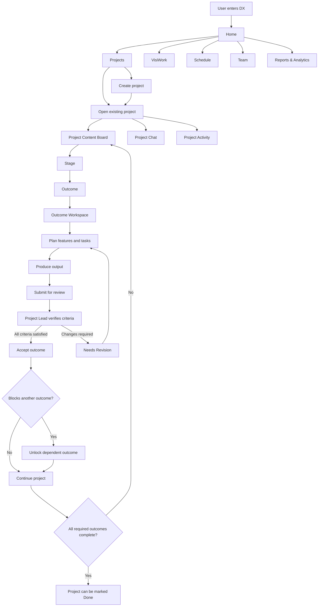
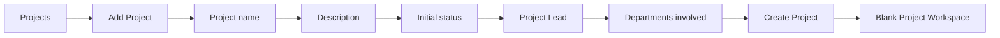
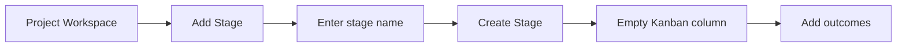
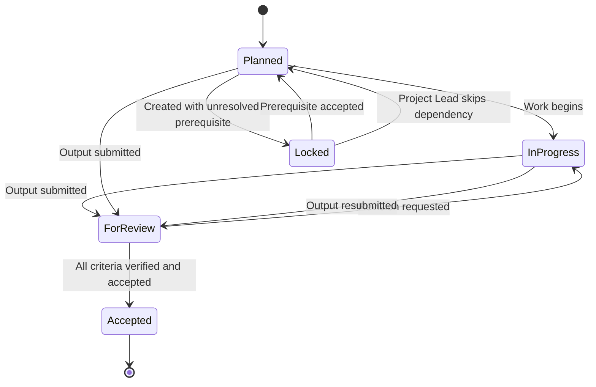
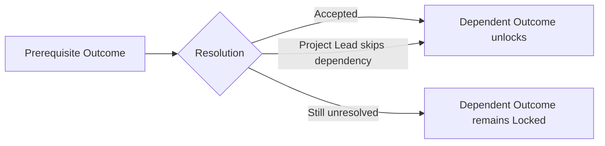
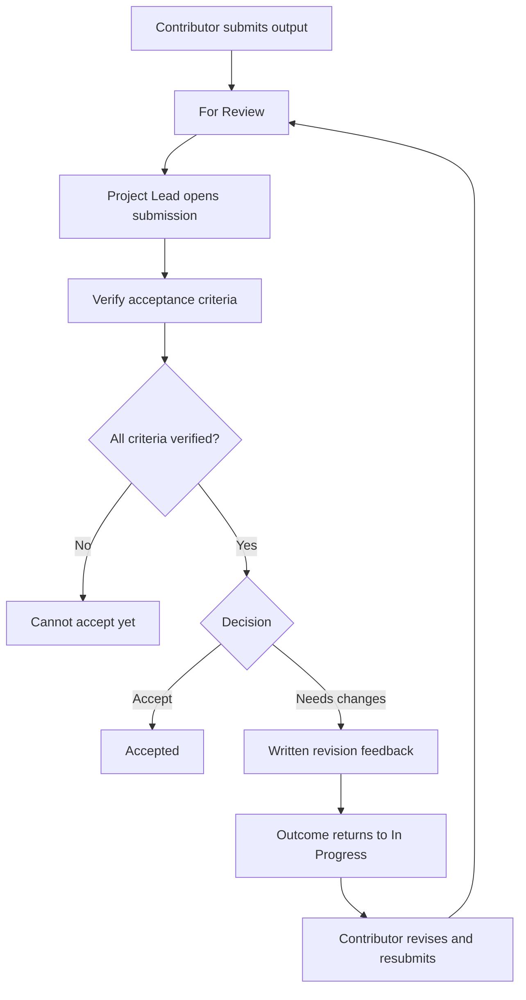

# DX System Flow

## 1. Purpose

DX is a virtual office system for a small software startup.
It combines project delivery, department visibility, work scheduling, attendance, collaboration, and operating analytics in one workspace.
The system is designed around outcomes rather than forcing the Project Lead to define every implementation task.
The Project Lead defines what must be achieved, while the people responsible for an outcome decide how to achieve it through features, tasks, and submitted outputs.

## 2. Core Operating Model

The primary work hierarchy is:

```text
Company
  -> Project
    -> Stage
      -> Outcome
        -> Department ownership
        -> Contributors
        -> Acceptance criteria
        -> Prerequisite, if any
        -> Features
          -> Tasks
        -> Output submissions
          -> Project Lead review
          -> Accepted or Needs Revision
```

A project is the main delivery container.
A stage groups related outcomes into a visible project phase.
An outcome describes a result that must become true, not a list of implementation instructions.
Features and tasks are the contributor's working plan for producing the outcome.
The output is the reviewable evidence or deliverable produced from that work.
Acceptance criteria are the Project Lead's objective checklist for deciding whether the output satisfies the intended outcome.

## 3. Main Roles

### Project Lead

The Project Lead owns project direction and outcome acceptance.
The Project Lead can create and rename stages.
The Project Lead can create outcomes and define their departments, contributors, acceptance criteria, and prerequisite.
The Project Lead can view the whole project regardless of assignment.
The Project Lead reviews submitted outputs against the acceptance criteria.
The Project Lead can accept an output or request revision.
The Project Lead can override a blocking prerequisite by skipping the dependency.
The Project Lead can change the project state between Pending, In Progress, and Done.

### Project Member

A Project Member primarily sees work assigned to or joined by that member.
A member assigned to an outcome can define features and tasks for that outcome.
A member can save an output draft and submit the output for review when the outcome is executable.
A member can join another outcome to become a contributor.
A non-contributor may inspect an outcome but remains read-only until joining it.

## 4. Global Navigation

The primary navigation contains:

1. Home
2. Projects
3. VisiWork
4. Schedule
5. Team
6. Reports & Analytics
7. Settings

Settings is present in navigation, but the current prototype does not define a functional Settings workflow.

## 5. High-Level System Flow



## 6. Home Flow

Home acts as the company command center.
It summarizes what is happening across the organization rather than replacing the detailed workspaces.

The Home page shows:

- Working Now.
- Active Projects.
- Outcomes Awaiting Review.
- Revision Requests.
- The current user's worked hours compared with planned hours.
- Company Activity.
- Needs Attention signals.
- Quick links to Projects, Schedule, Team, and Reports.

The Company Activity feed merges operational events from different parts of the system.
Activity can be filtered into categories such as time and attendance, projects, outcomes, tasks, outputs and reviews, schedules, and people.

## 7. Project Creation Flow

Any current prototype user can open the Add Project modal from the Projects page.
The prototype does not currently restrict project creation by role.

The creator provides:

- Project name.
- Description.
- Initial status.
- Project Lead.
- Departments involved.

The available initial statuses are Planning, In Progress, and Done.
The project is created with a blank project workspace.
Stages and outcomes are intentionally created afterward inside the project.



## 8. Projects Landing Flow

Projects are grouped by project state.
The current landing board groups projects into Planning, In Progress, and Done.
Users can search projects from the landing page.
Each project card can summarize project progress, open outcomes, active stages, departments involved, and people currently working on the project.
Opening a project enters its canonical Project Workspace.

## 9. Project Workspace Flow

The canonical Project Workspace contains three primary areas:

- Content.
- Chat.
- Activity.

The header shows project identity, Project Lead, project state, and project progress.
Project progress is outcome-based.
The prototype summarizes accepted outcomes against total outcomes rather than estimating progress from stage names alone.

### Content

Content is the delivery surface.
Stages appear as Kanban-style columns.
Outcomes appear inside their stage.

The board supports two scopes:

- My Work.
- Whole Work.

For a normal member, My Work contains outcomes where the member is an assigned contributor.
For the Project Lead, Whole Work is the primary supervisory view.

## 10. Stage Flow

Only the Project Lead can create or rename project stages in the canonical workspace.
A newly created stage starts empty.
Outcomes are added after the stage exists.
Renaming a stage preserves its outcomes, dependencies, and history.



## 11. Outcome Creation Flow

Only the Project Lead creates outcomes in the canonical workspace.
An outcome must belong to a stage.

The Project Lead defines:

- Stage.
- One or more departments.
- One or more members.
- Outcome title.
- Optional outcome description.
- One or more acceptance criteria.
- Optional prerequisite outcome.

At least one department is required.
At least one member is required.
At least one acceptance criterion is required.

The first selected member becomes the primary assigned member.
Additional selected members become participants or contributors.
The first selected department becomes the primary department while all selected departments remain associated with the outcome.

If no prerequisite is selected, the outcome begins as Planned.
If a prerequisite is selected, the outcome begins as Locked.

## 12. Outcome States

The canonical outcome states are:

```text
Planned
In Progress
For Review
Needs Revision
Accepted
Locked
Skipped
```

`Needs Revision` is represented by the output state while the outcome returns to In Progress.
`Skipped` is used when the Project Lead overrides a prerequisite outcome as a blocking dependency.

### State Transition Model



## 13. Outcome Workspace Flow

Selecting an outcome opens its dedicated workspace.
The outcome workspace keeps the expected result, acceptance criteria, work plan, output history, prerequisite, ownership, progress, and recent activity together.

A contributor sees the workspace as an execution environment.
The Project Lead sees another member's outcome primarily as a supervisory and review environment.
A non-contributor sees it as read-only and may join the outcome.

### Outcome Workspace Structure

```text
Outcome Header
  -> Stage and departments
  -> Outcome title and description
  -> Current state
  -> Expected outcome
  -> Acceptance criteria

Work Plan
  -> Features
    -> Tasks

Output
  -> Draft
  -> Notes
  -> Versioned submissions
  -> Review result

Context Rail
  -> Progress
  -> Departments
  -> Contributors
  -> Prerequisite
  -> Recent activity
```

## 14. Join Outcome Flow

A Project Member who is not already a contributor can inspect an outcome.
The member remains read-only until joining the outcome.
Selecting Join Outcome adds the current member to the outcome's participants.
The join action is recorded in project activity.
After joining, the member can contribute to the work plan and, when execution is allowed, to the output.
The Project Lead does not use Join Outcome as a supervisory action.

## 15. Feature and Task Flow

Features and tasks are implementation planning details beneath an outcome.
They are intentionally not required to be defined by the Project Lead during initial project planning.
Contributors can shape the work after the outcome is assigned.

A feature contains:

- Feature name.
- Optional short description.
- Zero or more tasks.

Tasks can be added, completed, reopened, or deleted by an authorized contributor.
Feature and task completion drives the outcome's work-plan progress percentage.
The current progress calculation is based on completed tasks divided by total tasks.

This keeps the responsibility split clear:

```text
Project Lead defines WHAT success means.
Contributors define HOW the work gets done.
Project Lead verifies whether the submitted result actually satisfies the outcome.
```

## 16. Locked Outcome Behavior

A locked outcome is blocked by an unresolved prerequisite.
The contributor may still plan the work by creating features and tasks.
The contributor cannot mark tasks complete while the outcome remains locked.
The contributor cannot submit an output while the outcome remains locked.
This allows preparation without allowing dependent execution to be treated as valid progress.

## 17. Prerequisite and Dependency Flow

A prerequisite links one outcome to a dependent outcome.
The dependent outcome stays Locked until the prerequisite is resolved.

A prerequisite is resolved in either of two ways:

1. The prerequisite output is accepted by the Project Lead.
2. The Project Lead explicitly skips the dependency because the project direction changed.

When a prerequisite is accepted, its dependent outcome automatically changes from Locked to Planned.
When the Project Lead skips the dependency, the prerequisite is marked Skipped and the dependent outcome becomes Planned.
The override remains visible in project history.



## 18. Output Submission Flow

An executable contributor can prepare an output in the outcome workspace.
The output may be a name, link, document reference, build, design, or other reviewable deliverable.
The contributor may also provide notes explaining what changed or what the reviewer should verify.

The contributor can save the work as a draft.
A draft does not enter Project Lead review.

When Submit for Review is selected:

1. A new versioned submission is created.
2. The output state becomes For Review.
3. The outcome state becomes For Review.
4. The submission records the submitter and submission time.
5. The event is recorded in activity.

Resubmission after a revision request creates another version rather than overwriting the earlier review record.

## 19. Project Lead Review Flow

The Project Lead reviews the latest submitted output.
The acceptance criteria are used as explicit verification checks.
Every acceptance criterion must be verified before the prototype allows the output to be accepted.

The Project Lead then chooses one of two decisions.

### Accept

Accept marks the latest submission Accepted.
The outcome becomes Accepted.
Outcome progress becomes 100 percent.
Feedback is stored with the review.
If the outcome is a prerequisite for another outcome, the dependent outcome is unlocked.

### Needs Revision

A revision request requires written feedback.
The latest submission becomes Needs Revision.
The outcome returns to In Progress.
The submitted output is restored into the member's working draft so it can be revised and resubmitted.
The previous submission remains in history.



## 20. Versioned Submission History

Each outcome keeps a submission history.
The latest submission is shown first.
Older submissions remain reviewable for traceability.
A submission record can contain version, title or link, state, submitter metadata, notes, feedback, and criterion verification state.
This prevents revision cycles from erasing earlier decisions.

## 21. Project Completion Flow

Project progress is based primarily on outcome completion.
An Accepted outcome counts as complete.
Skipped dependency outcomes are retained as historical decisions rather than silently deleted.

The Project Lead can change the project state between:

```text
Pending
In Progress
Done
```

The current prototype does not automatically force the project into Done when every outcome is accepted.
The Project Lead still controls the project-state decision.
A production implementation should decide whether Done is manually controlled, automatically suggested, or automatically enforced.

## 22. Project Chat and Announcements

Each project has a local project chat.
Chat is intended for coordination, decisions, and handoffs related to that project.

The project also has announcements.
Announcements contain a title, optional body, author, timestamp, and optional pinned state.
Pinned announcements stay at the top of the announcement list.
The current prototype allows project announcements from the project workspace without a strict Project Lead-only gate.
If announcements are intended to be managerial, that permission should be made explicit in production.

## 23. Project Activity and Audit Flow

The project records meaningful actions as activity events.
Examples include:

- Project changes.
- Stage creation or rename.
- Outcome creation.
- Feature changes.
- Task changes.
- Outcome membership changes.
- Output drafts and submissions.
- Review decisions.
- Dependency overrides.
- Announcements.

A normal member primarily sees personal project history.
The Project Lead can see broader audit activity and filter it by member and activity type.
Activity entries can link back to their outcome when applicable.

## 24. VisiWork Flow

VisiWork is the cross-project operational view.
It provides both department-centric and project-centric perspectives.

### Department Mode

Department mode begins with Bird's View.
Bird's View summarizes departments and their work.
A department can be previewed without fully entering its room.
A user can enter a department room to inspect the projects, stages, and outcomes owned by that department.

Department-room permission is shown as either Joined / active or View only depending on the current member's active department context.

### Project Mode

Project mode summarizes company projects with progress, departments, active workers, active stages, and open outcomes.
From the project overview, a user can open the same canonical Project Workspace used by the Projects page.
This avoids creating separate project logic for VisiWork.

### VisiWork Chat

VisiWork includes a general chat surface.
Entering a department changes the chat scope to that department.
Leaving the department returns chat scope to General.

## 25. Schedule Flow

Schedule separates planned commitment from actual work.

```text
Schedule = planned commitment.
Schedule override = date-specific adjustment to the plan.
Time In / Time Out = actual recorded work session.
```

The Schedule page has two main modes:

- Team Schedule.
- Shifts.

### Team Schedule

Team Schedule merges member schedules into one weekly calendar.
Users can filter by people and department.
Overlapping schedules are visually arranged side by side.

### Configure My Schedule

A user can configure only the current user's schedule.
Entering configuration mode changes the action button to Done.

The user can define:

- Weekly target hours.
- Preferred hours per day.
- Number of rest days.

The system can generate an initial weekly schedule from those values.
The user can then adjust the generated blocks.
The prototype supports moving blocks, resizing blocks, and marking rest days.
The weekly target remains visible while the schedule is being adjusted.

### Schedule Overrides

The schedule also supports date-specific overrides.
An override changes only the selected date and does not redefine the member's default weekly schedule.
The day detail can show the default plan, override, actual sessions, scheduled hours, worked hours, overlap, and work outside schedule.

## 26. Time In and Time Out Flow

The global Time In / Time Out control records actual work sessions.
It is separate from scheduled commitment.

When the user selects Time In:

1. A live work session begins for the current user.
2. The session start time is recorded.
3. The user appears as Working Now.
4. Home and Team presence can reflect the active session.

When the user selects Time Out:

1. The session end time is recorded.
2. The session is added to actual work history.
3. Worked time is compared with scheduled time.
4. Company activity records the Time Out event.

The system allows work to be recorded even when the user has no planned shift.
That work is classified as outside schedule rather than rejected.
The system can also show overtime when actual work exceeds planned hours.

## 27. Team Flow

The Team page provides an operational view of people.
It shows team size, how many members are currently working, and total worked hours compared with scheduled hours.

Each member card shows:

- Name.
- Role.
- Current working status.
- Today's planned schedule.
- Scheduled hours for the week.
- Worked hours for the week.

Selecting View Schedule opens that person's shift view for deeper inspection.

## 28. Reports and Analytics Flow

Reports & Analytics aggregates operational data from projects and schedules.

The current prototype includes:

- Average project progress.
- Accepted outcome count.
- Outcomes needing review or revision.
- Team capacity used.
- Project health.
- Outcome pipeline.
- Team capacity by member.
- Department workload.

The outcome pipeline groups work into Planned, In Progress, For Review, Needs Revision, Accepted, and Locked.
Team capacity compares recorded worked hours with planned commitment.
Department workload measures outcome ownership and open work by department.

## 29. Company Activity as a Shared Audit Layer

Actions from different modules feed a company-level activity stream.
This creates a common operational record across project delivery, scheduling, attendance, and people activity.

Examples include:

```text
User timed in.
User timed out.
Project created.
Stage created or renamed.
Outcome created.
Member joined outcome.
Task completed.
Output submitted.
Output accepted.
Revision requested.
Dependency skipped.
Announcement posted.
Schedule changed.
```

This activity stream supports both Home visibility and Reports-oriented analysis.

## 30. Permission Summary

| Action | Project Lead | Assigned or Joined Member | Other Member |
| --- | --- | --- | --- |
| Create project | Yes in current prototype | Yes in current prototype | Yes in current prototype |
| Change project state | Yes | No | No |
| Create or rename stage | Yes | No | No |
| Create outcome | Yes | No | No |
| Define acceptance criteria | Yes at outcome creation | No | No |
| View whole project | Yes | Yes through Whole Work | Yes through Whole Work |
| Inspect outcome | Yes | Yes | Yes |
| Join outcome | Not applicable | Already joined | Yes |
| Add features and tasks | Only when the lead is also the primary assignee | Yes | After joining |
| Complete tasks | Only when the lead is also the primary assignee and outcome is unlocked | Yes when unlocked | After joining and when unlocked |
| Save or submit output | Only when the lead is also the primary assignee and outcome is unlocked | Yes when unlocked | After joining and when unlocked |
| Verify acceptance criteria | Yes | No | No |
| Accept output | Yes | No | No |
| Request revision | Yes | No | No |
| Skip prerequisite | Yes | No | No |
| Use project chat | Yes | Yes | Yes when project is accessible |
| Post announcement | Yes in current prototype | Yes in current prototype | Yes in current prototype |
| Configure own schedule | Yes | Yes | Yes |
| Configure another person's schedule | No | No | No |
| View another person's shift history | Yes in current prototype | Yes in current prototype | Yes in current prototype |

## 31. Core System Rules

### Rule 1: Outcomes are the Project Lead's primary planning unit.

The Project Lead should not need to micromanage every task before work starts.
The Project Lead defines the required result and acceptance standard.

### Rule 2: Features and tasks belong close to the people doing the work.

Contributors should be able to decompose an outcome into practical work without requiring the Project Lead to define every implementation detail.

### Rule 3: Progress and acceptance are different concepts.

Task completion measures execution progress.
Only Project Lead acceptance confirms that the outcome has actually been achieved.

### Rule 4: Dependencies block execution, not planning.

A locked outcome can be prepared in advance, but its tasks cannot be completed and its output cannot be submitted until the dependency is resolved.

### Rule 5: Review history should never be overwritten.

Every submitted version and review decision should remain visible.

### Rule 6: Schedule and attendance are separate sources of truth.

Schedule represents planned commitment.
Time In and Time Out represent actual work.
Variance between the two is information, not automatically an error.

### Rule 7: The same project workspace should be reused everywhere.

Projects opened from Projects or VisiWork should resolve to the same canonical project state and workflow.
This prevents different pages from developing conflicting project behavior.

### Rule 8: Important actions should emit activity events.

Project, delivery, review, membership, schedule, and attendance actions should feed a shared audit layer.

## 32. Primary End-to-End Delivery Example

```text
1. A user creates a project.
2. The project starts with a blank workspace.
3. The Project Lead creates project stages.
4. The Project Lead creates outcomes inside the stages.
5. Each outcome receives department ownership, contributors, acceptance criteria, and optional prerequisites.
6. Contributors open their assigned outcomes.
7. Contributors define features and tasks.
8. Contributors execute the tasks.
9. Contributors prepare an output.
10. Contributors submit the output for Project Lead review.
11. The Project Lead verifies every acceptance criterion.
12. The Project Lead either accepts the output or requests revision.
13. If revision is requested, the contributor revises and resubmits a new version.
14. If accepted, the outcome becomes complete.
15. Any dependent outcome becomes unlocked.
16. Project progress updates as outcomes are accepted.
17. The Project Lead eventually marks the project Done.
18. Project and company activity retain the history of the workflow.
```

## 33. Current Prototype Gaps and Decisions to Resolve

These items are visible in the prototype but are not yet fully defined as system rules.

### Project creation permission

The current prototype allows the Add Project action without a role gate.
If the intended rule remains that anybody can create a project, this should be documented explicitly as a product rule.
If not, creation authority needs a formal permission.

### Announcement permission

The current prototype does not restrict project announcements to the Project Lead.
The production model should decide whether announcements are open collaboration or lead-controlled communication.

### Project completion enforcement

The Project Lead can mark a project Done manually.
The system does not currently require every outcome to be accepted first.
The production model should decide whether incomplete outcomes block Done, trigger a warning, or are allowed intentionally.

### Dependency scope

The older prototype language suggests prerequisites may be intended primarily within the same stage.
The canonical workspace currently allows selecting an available outcome without an explicit same-stage restriction.
The production rule should decide whether dependencies are stage-local or project-wide.

### Settings

Settings appears in navigation but has no defined functional workflow in the current prototype.

## 34. Recommended Canonical Flow Summary

The system should treat this sequence as the canonical project-delivery path:

```text
Create Project
-> Create Stages
-> Define Outcomes
-> Assign Departments and Contributors
-> Define Acceptance Criteria
-> Add Optional Dependencies
-> Contributors Plan Features and Tasks
-> Contributors Execute Work
-> Submit Versioned Output
-> Project Lead Verifies Criteria
-> Accept or Request Revision
-> Resolve Dependencies
-> Update Project Progress
-> Mark Project Done
-> Preserve Activity and Review History
```

Everything else in DX supports this delivery loop.
Home provides awareness.
VisiWork provides organizational visibility.
Schedule provides planned availability.
Time In and Time Out provide actual work records.
Team provides people visibility.
Reports & Analytics aggregates the resulting operational data.
